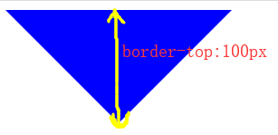

# HTML+CSS

## HTTP

HTTP 是超文本传输协议，也就是HyperText Transfer Protocol.

**HTTP 是一个在计算机世界里专门在「*两点*」之间「传输」文字、图片、音频、视频等「超文本」数据的「约定和规范」**

优点：简单、灵活和易于扩展、应用广泛和跨平台。

缺点： 无状态双刃剑、明文传输双刃剑、不安全

### 常见状态码

1xx     提示信息，表示目前是协议处理的中间状态，还需要后续的操作。很少见

2xx	 成功，报文已经收到并被正确处理；				200、204、206

3xx	 重定向，资源位置发生变动，需要客户端重新发送请求；		301、302、304

4xx	 客户端错误，请求报文有误，服务器无法处理；		400、403、404

5xx	 服务器错误，服务器在处理请求时内部发生了错误。		500、501、502、503

### GET和POST

Get 方法的含义是请求从服务器获取资源，这个资源可以是静态的文本、页面、图片视频等。

比如，你打开我的文章，浏览器就会发送 GET 请求给服务器，服务器就会返回文章的所有文字及资源。

POST 方法则是相反操作，它向 URI 指定的资源提交数据，数据就放在报文的 body 里。

比如，你在我文章底部，敲入了留言后点击「提交」（暗示你们留言），浏览器就会执行一次 POST 请求，把你的留言文字放进了报文 body 里，然后拼接好 POST 请求头，通过 TCP 协议发送给服务器。

先说明下**安全**和**幂等**的概念：

- 在 HTTP 协议里，所谓的「安全」是指请求方法不会「破坏」服务器上的资源。

- 所谓的「幂等」，意思是多次执行相同的操作，结果都是「相同」的。

 **GET** 方法就是安全且幂等的，因为它是「**只读**」操作，无论操作多少次，服务器上的数据都是安全的，且每次的结果都是相同的。

**POST** 因为是「新增或提交数据」的操作，会修改服务器上的资源，所以是不安全的，且多次提交数据就会创建多个资源，所以不是幂等的。

### **TCP传输的三次握手四次挥手**

**三次握手**：发送端首先发送一个带SYN标志的数据包给对方。

接收端收到后，回传一个带有SYN/ACK标志的数据包以示传达确认信息。 
最后，发送端再回传一个带ACK标志的数据包，代表“握手”结束。 
若在握手过程中某个阶段莫名中断，TCP协议会再次以相同的顺序发送相同的数据包。

**四次挥手**：第一次挥手：主动关闭方发送一个FIN，用来关闭主动方到被动关闭方的数据传送，也就是主动关闭方告诉被动关闭方：我已经不会再给你发数据了(当然，在fin包之前发送出去的数据，如果没有收到对应的ack确认报文，主动关闭方依然会重发这些数据)，但是，此时主动关闭方还可以接数据。

第二次挥手：被动关闭方收到FIN包后，发送一个ACK给对方，确认序号为收到序号+1（与SYN相同，一个FIN占用一个序号）。

第三次挥手：被动关闭方发送一个FIN，用来关闭被动关闭方到主动关闭方的数据传送，也就是告诉主动关闭方，我的数据也发送完了，不会再给你发数据了。

第四次挥手：主动关闭方收到FIN后，发送一个ACK给被动关闭方，确认序号为收到序号+1，至此，完成四次挥手。

### **HTTP和HTTPS**

HTTP协议通常承载于TCP协议之上，在HTTP和TCP之间添加一个安全协议层（SSL或TSL），这个时候，就成了我们常说的HTTPS。

默认HTTP的端口号为80，HTTPS的端口号为443。

为什么HTTPS安全？

因为网络请求需要中间有很多的服务器路由器的转发。中间的节点都可能篡改信息，而如果使用HTTPS，密钥在你和终点站才有。https之所以比http安全，是因为他利用ssl/tls协议传输。它包含证书，卸载，流量转发，负载均衡，页面适配，浏览器适配，refer传递等。保障了传输过程的安全性。

## meta标签

meta主要用于设置网页中的一些元数据，元数据不是给用户看

1、charset 指定网页的字符集

2、name 指定的数据的名称

​	keywords 表示网站的关键字，可以同时指定多个关键字，关键字间使用,隔开

​	description 用于指定网站的描述

3、content 指定的数据的内容

4、title标签的内容会作为搜索结果的超链接上的文字显示

5、http-equiv="refresh" 用于重定向

```html
<meta charset="UTF-8">
<meta name="keywords" content="HTML5,前端,CSS3">
<meta name="description" content="这是一个非常不错的网站" title="解释">
<meta http-equiv="refresh" content="3;url=https://www.baidu.com">
```

## 实体

```
实体的名字:
     &nbsp; 空格
     &gt; 大于号
     &lt; 小于号
     &copy; 版权符号
```

## 语义化标签

em标签用于表示语音语调的一个加重

strong表示强调，重要内容！

blockquote 表示一个长引用

q表示一个短引用

```html
<p>今天天气<em>真</em>不错！</p>
<p>你今天必须要<strong>完成作业</strong>！</p>
<blockquote>这句话我是从来没有说过的！</blockquote>
子曰<q>学而时习之，乐呵乐呵！</q>
```

### 布局标签(结构化语义标签)

header 表示网页的头部

main 表示网页的主体部分(一个页面中只会有一个main)

footer 表示网页的底部

nav 表示网页中的导航

aside 和主体相关的其他内容（侧边栏）

article 表示一个独立的文章

section 表示一个独立的区块，上边的标签都不能表示时使用section

div 没有语义，就用来表示一个区块，目前来讲div还是我们主要的布局元素

span 行内元素，没有任何的语义，一般用于在网页中选中文字


一般情况下会在块元素中放行内元素，而不会在行内元素中放块元素

\- 块元素中基本上什么都能放

\- p元素中不能放任何的块元素

## 超链接

target属性，用来指定超链接打开的位置

​      可选值：

​        _self 默认值 在当前页面中打开超链接

​        _blank 在一个新的要么中打开超链接

去除下划线： text-decoration: none;

可以跳转到页面的指定位置，只需将href属性设置 #目标元素的id属性值

```html
<a href="#bottom" target="_blank">去底部</a>
```

:link 用来表示没访问过的链接（正常的链接）

:visited 用来表示访问过的链接 (由于隐私的原因，所以visited这个伪类只能修改链接的颜色)

:hover 用来表示鼠标移入的状态

:active 用来表示鼠标点击

```css
a:link{}
a:visited{}
a:hover{}
a:active{}
```

可以操控同级或下一级的元素，如操纵wrap盒子下的a标签：#wrap:hover a{}    #wrap:hover + a{}   

操纵自身伪元素：#wrap:hover::before{}

## 内联框架iframe

使用内联框架可以引入一个外部的页面

​    使用iframe来创建一个内联框架

​    属性：

​     src ：指向一个外部页面的路径，可以使用相对路径，

​     width，height，

​     name ：可以为内联框架指定一个name属性  

​	frameborder 指定内联框架的边框   

   在现实开发中不推荐使用内联框架，因为内联框架中的内容不会被搜索引擎所检索

```html
<iframe src="demo02.html" name="tom" width="800" height="600" frameborder="0"></iframe>
a标签的target属性可以设置一个内联框架的name属性值，链接将会在指定的内联框架中打开
<a href="demo03.html" target="tom">我是一个超链接</a>
<iframe src="demo02.html" name="tom"></iframe>
```

## 音视频

audio    video

属性：

​      controls 是否允许用户控制播放

​      autoplay 音频文件是否自动播放

​        \- 如果设置了autoplay 则音乐在打开页面时会自动播放

​          但是目前来讲大部分浏览器都不会自动对音乐进行播放 

​      loop 音乐是否循环播放

两种引入方式:

```html
<audio src="./source/audio.mp3" controls autoplay loop></audio>
<audio controls>
        <!-- 对不起，您的浏览器不支持播放音频！请升级浏览器！ -->
        <source src="./source/audio.mp3">
        <source src="./source/audio.ogg">
        <embed src="./source/audio.mp3" type="audio/mp3" width="300" height="100">
</audio>
```

视频和音频的引入方式基本上是一样的

```html
<embed src="./source/flower.mp4" type="video/mp4">
```

## 选择器

**元素选择器**	作用：根据标签名来选中指定的元素

**id选择器**	 作用：根据元素的id属性值选中一个元素   id值只能是唯一的	\#id属性值{}

**类选择器**	作用：根据元素的class属性值选中一组元素   class值可以是多个	.class属性值{}

**通配选择器**	作用：选中页面中的所有元素    *{}

**交集选择器**

​        作用：选中同时复合多个条件的元素

​        语法：选择器1选择器2选择器3选择器n{}

```css
div.red{}
div#box1{}
.a.b.c{}
```

**并集选择器**

​        作用：同时选择多个选择器对应的元素，用,号隔开

​        语法：选择器1,选择器2,选择器3,选择器n{}

```css
h1, span{}
```

**子元素选择器**

​        作用：选中指定父元素的指定子元素

​        语法：父元素 > 子元素

```css
div.box > span{}
```

**后代元素选择器**

​        作用：选中指定元素内的指定后代元素，用空格隔开

​        语法：祖先 后代

```css
div span{}
```

**选择下一个兄弟**

​        语法：前一个 + 下一个

```
p + span{}
```

—  选择**紧跟**p标签后面的第一个span标签，中间有其他元素就无法生效

**选择下边所有的兄弟**

​        语法：兄 ~ 弟

```css
p ~ span{}
```

**属性选择器**

​	[属性名] 选择含有指定属性的元素

​    [属性名=属性值] 选择含有指定属性和属性值的元素

​    [属性名^=属性值] 选择属性值以指定值开头的元素

​    [属性名$=属性值] 选择属性值以指定值结尾的元素

​    [属性名*=属性值] 选择属性值中含有某值的元素的元素

```css
p[title]{}
p[title=abc]{}
p[title^=abc]{}
p[title$=abc]{}
p[title*=e]{}
```

**伪类选择器**

:first-child 第一个子元素

:last-child 最后一个子元素

:nth-child() 选中第n个子元素

​	-2n 或 even 表示选中偶数位的元素

​    -2n+1 或 odd 表示选中奇数位的元素

:nth-last-child（n）：倒数

```css
ul > li:first-child{} 
ul > li:last-child{}
ul > li:nth-child(n){}
```

:first-of-type

:last-of-type

:nth-of-type()

   \- 这几个伪类的功能和上述的类似，不同点是他们是在同类型元素中进行排序

:not() 否定伪类

​        \- 将符合条件的元素从选择器中去除

**伪元素选择器**

::first-letter 表示第一个字母

 ::first-line 表示第一行

 ::selection 表示选中的内容

::before 元素的开始 

 ::after 元素的最后

​     \- before 和 after 必须结合content属性来使用

```css
div::before{
	content: 'abc';
}
div::after{
	content: 'haha';
}
```

**选择器权重**

!important > 内联样式 > id选择器 > 类和伪类选择器 > 元素选择器 > 通配选择器 > 继承的样式

## 单位 默认时百分比

**单位**

em

\- em是相对于元素的字体大小来计算的

\- 1em = 1font-size

rem

\- rem是相对于根元素的字体大小来计算

\- html（根元素、初始包含块）

**默认时百分比都是相对于谁计算**

1.相对于父级元素宽高
width, height, margin,padding, text-indent ... 等

2.相对于父级定位元素宽高
top, left, right, bottom

3.相对于自身宽高
border-radius, translate, transform-origin, zoom,background-size

4.相对于自身字体大小
line-height

5.相对于继承字体大小
font-size

## 列表

列表之间可以互相嵌套

### 有序列表ol

有序列表，使用ol标签来创建有序列表

​    使用li表示列表项 

type属性，可以指定序号的类型

​    可选值：1，默认值，使用阿拉伯数字

​      a/A 采用小写或大写字母作为序号

​      i/I 采用小写或大写的罗马数字作为序号

```html
<ol type="I">
        <li>结构</li>
        <li>表现</li>
        <li>行为</li>
    </ol>
```

### 无序列表ul

无序列表，使用ul标签来创建无序列表

​    使用li表示列表项

通过type属性可以修改无序列表的项目符号

​    可选值：

​     disc，默认值，实心的圆点

​     square，实心的方块

​     circle，空心的圆

**注意：默认的项目符号我们一般都不使用**

去除li标签前面的圆点  ul{  list-style: none;  }

```html
<ul>

    <li>结构</li>

    <li>表现</li>

    <li>行为</li>

  </ul>
```

### 定义列表dl

定义列表，使用dl标签来创建一个定义列表

​    使用dt来表示定义的内容

​    使用dd来对内容进行解释说明

```html
<dl>
        <dt>结构</dt>
        <dd>结构表示网页的结构，结构用来规定网页中哪里是标题，哪里是段落</dd>
        <dd>结构表示网页的结构，结构用来规定网页中哪里是标题，哪里是段落</dd>
        <dd>结构表示网页的结构，结构用来规定网页中哪里是标题，哪里是段落</dd>
</dl>
```

## border

当要用border画三角形之类的，border-top这些设置的宽度其实是三角形的高



```css
.sjx{
    width: 0px;
    height: 0px;           
    border: 100px solid transparent;
    border-top: 100px solid blue;
    border-bottom: none;
}
```

**box-sizing**

\-content-box 是默认值

\-border-box ：你想要设置的边框和内边距的值是包含在width内的

**border-style** 边框样式

可选值：

​     \*  none，默认值，没有边框

​     \*  solid 实线

​     \*  dotted 点状边框

​     \*  dashed 虚线

​     \*  double 双线

**border-radius**  圆角样式 单位：px  %

​	\- 一个值：四个角一样

​	\- 两个值：左上角和右下角  右上和左下

​	\- 三个值：左上  右上和左下  右下

​	\- 四个值：左上  右上  右下  左下 

**border-collapse**：用来决定表格的边框是分开的还是合并的

​	- collapse  合并

​	- separate 分隔

## font字体

使用font设置字体样式时，斜体 加粗 小大字母，没有顺序要求，甚至可写可不写，如果不写则使用默认值，但是**要求文字的大小和字体必须写**，而且**字体必须是最后一个样式**，**大小必须是倒数第二个样式**

### 文字样式

#### 字体样式

**font-family**:"黑体",NsimSun;(通常使用系统上默认自带的字体,否则没有安装这个字体的人,将看不到字体效果)

上传到服务器的字体样式引用：

```CSS
@font-face {
    /* 指定字体的名字 */
    font-family:'myfont' ;
    /* 服务器中字体的路径，format字体的格式，如下面的truetype代表的就是.ttf格式 */
    src: url('./font/ZCOOLKuaiLe-Regular.ttf') format("truetype");
}
P{
    font-family: myfont;
}
```

**首行缩进**：

text-indent用来设置首行缩进

​     \* 当给它指定一个正值时，会自动向右侧缩进指定的像素

​     \* 如果为它指定一个负值，则会向左移动指定的像素,

​     \*  通过这种方式可以将一些不想显示的文字隐藏起来

​     \* 这个值一般都会使用em作为单位

text-indent: 1em;

**文本对齐**:   **text-align**:left(默认)/ right/ center/justify(两端对齐);

***text-align可以使行内元素或行内块元素水平居中***

**letter-spacing**可以指定字符间距

**word-spacing**可以设置单词之间的距离

​     \* 实际上就是设置词与词之间空格的大小

#### 显示省略号

1.overflow:hidden;(超出隐藏)

2.white-space:nowrap;(文本不换行)

3.text-overflow:ellipsis;(文本溢出显示省略号)

### 文本样式

text-transform    文本样式

​	- 属性值：capitalize：首字母大写

​					  uppercase：字母大写

​					   lowercase：字母小写

text-decoration可以用来设置文本的修饰

​    可选值：

​     \*   none：默认值，不添加任何修饰，正常显示

​     \*   underline 为文本添加下划线

​     \*   overline 为文本添加上划线

​     \*   line-through 为文本添加删除线

### 行高

line-height(设置字体行与行之间的距离)	行高=字体大小+行间距

想要让文本(元素)垂直居中，设置行高等于盒子的高度

### 基线对齐

**vertical-align**: top(上边对齐); 

text-top(字体上方对齐) / middle(中线对齐) / baseline(基线对齐)  / text-bottom(文字下边对齐) / bottom(下边对齐)

**vertical-align起作用的前提条件**：只有行内元素或行内块元素才有基线对齐问题

**解决图片下方空隙**（外层盒子没定高）:

1.使用 vertical-align:baseline;以外的属性值

2.把图片转换成块级元素(display:block;)

**图片和文字之间垂直居中对齐**

​	给文字和图片都设置 vertical-align:middle;

### 阴影

**text-shadow**   文本阴影

​	- x轴偏移量  y轴偏移量  模糊度  颜色  inset(内阴影)

**box-shadow**   盒子阴影

​	- x轴偏移量  y轴偏移量  模糊度  颜色  inset(内阴影)

## 元素特点

### 块级元素

display: block;

1.独占一行

2.可以容纳其他的块级标签和行级标签

3.p标签不可以包裹块级标签

### 行内元素

display: inline;

1.多个行内元素共享一行

2.不支持宽高，不支持上下的margin，不支持margin:auto;(img除外，但img不支持auto)

3.支持左右的margin，支持padding

4.上下padding只对自身有效 (上下padding不会影响其他元素的位置)

5.行级标签不能包裹块级标签 (a标签除外)

6.a标签不能套a标签

### 行内块元素

display:inline-block;

1.不支持margin:auto;

行内块间隙问题:(空白字符 -- 我们看不见 -- 实际存在的大小)

​		解决方案:

​			给行内块元素的父级设置字体大小为零，行内块元素字体重新设置大小

## 元素隐藏

display:none;

不占用任何位置

visibility:hidden;

在页面中存在，占位置

显示----值设为visible

opacity:0~1

设置为0，完全透明，占位置

设置为1，完全显示

## 背景样式background

背景颜色：background-color:;

背景图片：background-image:url(图片地址);

背景平铺：background-repeat:repeat(默认:重复); / no-repeat(不重复) / repeat-x(x轴平铺) / repeat-y(y轴平铺)

背景图片大小:background-size:;  (两个值:宽   高), 一个值等比例

​					 - cover等比例缩放图片直到覆盖背景区域

​					 - contain等比例缩放图片,直到有一条边触碰到盒子边框

背景图片显示位置:background-origin:;

​					默认值:padding-box(从padding区域开始显示)

​								content-box(从内容区域开始显示)

​								border-box(相对边框左上角开始显示)

背景定位:background-position:(px,%:可以是负值); 

​		关键词:left,top,bottom,right,center   

​		两个值(x,y)	如果是一个值,另一个值默认居中

背景图片剪裁:background-clip:; 

​				padding-box(显示内边距和内容区域部分的背景图)

​				content-box(显示内容区域部分的背景图)

​				border-box(显示内容区域,内边距和边框区域部分的背景图)

背景关联background-attachment:;

​		- 决定背景是在视口中固定还是随着包含它的区块滚动

​		- fixed (相对于视口固定)    scroll(默认，不随元素内部的文字滚动，但会随视口滚动)

背景复合样式写法:background:blue url("") no-repeat 50px 50px/200px 200px fixed;

​														**颜色 图片路径 背景平铺 背景定位/背景大小 背景关联**

​			background-origin  background-clip 两个样式 ，**orgin要在clip的前边**

多张背景图分样式书写:(用逗号隔开)

​							background-image:url(""),url("");

​							background-repeat:no-repeat,repeat-x;

​							background-size:100px 50px,200px 100px;

​							background-position:50px ,100px 100px;

### 渐变

渐变是通过background-image来设置

**线性渐变**

linear-gradient(red, blue)

​	\- 第一个颜色是0%，最后一个颜色是100%

linear-gradient(red 20px, blue 40px, yellow 60px)

​	\- 0-20px红色  40px开始是蓝色  60px开始是黄色    中间的是过渡段

linear-gradient(to left, red 20px, blue 40px, yellow 60px)

可以改变方向，但要放在前面，并用 , 号隔开

to left  向左  to right  向右   to bottom  向下  to top  向上  deg deg表示度数    turn 表示圈

**重复线性渐变**

repeating-linear-gradient(red 0, red 15px, black 15px, black 30px)

**径向渐变**

radial-gradient(ellipse 150px 50px at 100px 100px, red, black, blue)

radial-gradient(形状 [大小] at 圆心位置, 颜色 位置 ,颜色 位置 ,颜色 位置)

形状：circle 圆形  ellipse 椭圆  closest-side 近边   closest-corner 近角   farthest-side 远边    farthest-corner 远角

radial-gradient(closest-side, red, black, blue)

半径的长短:

​	\- closest-side：指定半径的长度  圆心到最近的边  距离开始渐变过渡

​	\- farthest-side：指定半径的长度  圆心到最远的边  距离开始渐变过渡

​	\- closest-corner：指定半径的长度  圆心到最近的角  距离开始渐变过渡

​	\- farthest-corner：指定半径的长度  圆心到最远的角  距离开始渐变过渡

radial-gradient(closest-side at 50px 50px, red, black, blue)

**重复径向渐变**

repeating-radial-gradient(red , red 10px, black 10px, black 20px)

## 定位、层级

position:;(指定位置)  

​	默认层级:同样设置定位的兄弟元素,根据body中元素的位置,后面的层级高     父子元素:子元素层级比父元素高

​	文档流:浏览器默认情况下,从左到右,从上到下的排列规则

static(静态定位)

​		特点:默认值,没有定位

### relative(相对定位)

​		特点:1.参照没有定位前自身的位置

​				2.有层级,在原本的文档流中仍然占据自己的位置

​				3.不会改变元素的特征

### absolute(绝对定位)

​		特点:1.参照最近的父级定位元素进行定位,如果没有参照浏览器左上角

​				2.有层级,脱离文档流,不会占据位置,后面的元素会占据它的位置

​				3.会把元素转换成块级,不支持magrin:auto;

### fixed(固定定位)

​		特点:1.生成绝对定位的元素,固定在视口,参考浏览器左上角定位

### sticky(粘滞定位)

\- 当元素的position属性设置为sticky时则开启了元素的粘滞定位

​          \- 粘滞定位和相对定位的特点基本一致，

​            不同的是粘滞定位可以在元素到达某个位置时将其固定

### 层级

z-index:;(数值,没有单位,可以是负值)

​				同级关系:数值越大层级越高

​				嵌套关系:单独给子元素设置层级,可以到父元素后面,不会影响父元素的层级。

​								单独给父元素设置层级,会影响子元素一起变换层级,子元素始终在父元素上面

​								同时给子元素父元素设置层级,依照父元素设置的层级生效,子元素跟随父元素变换层级。子元素设置的层级并非失效,但只能对父元素内的元素生效

## 浮动

最初的目的就是为了文字环绕图片。

浮动：就是想让盒子横排显示

方法：float: left / right;

脱离文档流，提升层次（提升了半个层级）

浮动定义：使元素脱离文档流，按照我们指定的方向发生移动，遇到父级边界 或者相邻的浮动元素停下来

浮动特点：

无论是 行内 块级 只要浮动就具备以下特点

​	1.display: block;

​	2.支持宽高，margin，padding

​	3.不支持 margin: auto;

​	4.不会造成间隙问题，不会存在基线对齐问题

### 高度塌陷

父级不给高度，父级高度塌陷。

```css
.box1::after{
            content: '';
            display: block;     这里display为table会更好一点
            clear: both;
        }
<div class="box1">
     <div class="box2"></div>
</div>
//最好还是按照这种方式来解决高度塌陷
//给父元素加个clearfix的class
.clearfix::before,
.clearfix::after{
    content: '';
    display: table;
    clear: both;
}
<div class="box1 clearfix">
     <div class="box2"></div>
</div>
```

### BFC

开启bfc：

​	1. 将元素的overflow设置为一个非visible的值       (推荐)

​		- 常用的方式 为元素设置 overflow:hidden 开启其BFC 以使其可以包含浮动元素

​	2.脱离文档流。开启浮动，float;  开启定位，position    （不推荐）

​	3.设置为行内块元素，display: inline-block;				（不推荐）

​	4.IE6及以下使用zoom: 1;(功能相同，但不是BFC)

当开启元素的BFC以后，元素将会具有如下的特性：

​     \* 1.父元素的垂直外边距不会和子元素重叠 

​     \* 2.开启BFC的元素不会被浮动元素所覆盖

​     \* 3.开启BFC的元素可以包含浮动的子元素，父元素的高度和宽度也会被子元素撑开

## 表单

form：双标签,存储表单元素的一个区域,块级标签

​	属性: action="表单需要提交的服务器地址"  	method="提交方式,get(默认值,获取信息),post(发送信息)"

表单组件:

### 	input：

​		行内块元素

```html
<input type="输入信息的类别" placeholder="占位符" name="名字" value="输入框原本的值">
```

readonly 将表单项设置为只读，数据会提交

disabled 将表单项设置为禁用，数据不会提交
autofocus 设置表单项自动获取焦点

​	**伪类**  :focus	

​		在元素获得焦点时,给元素添加特殊的样式,应用于有焦点的元素

​			类名:focus{border:1px solid red	outline:none;(外边框线)}

```html
#user:focus{
	border:1px solid red;
    outline:none;
}
<input type="text" placeholder="请输入账号" id="user"><br>
<input type="text" placeholder="请输入密码" id="sub">
/*可以给自己的其他兄弟添加样式，一般是自己的后面的兄弟*/
#user:focus + #sub{
	border:1px solid blue;
}
#user:focus ~ #sub{
	border:1px solid blue;
}
```

​		type:   1.text(普通文本类型)

​					2.password(密码框)

​					3.submit(提交功能的按钮)

​					4.reset(重置按钮)

​					5.button(普通按钮)

​					6.time(时间)

​					7.date(年月日)

​					8.week(周)

​					9.month(月)

​					10.datetime-local(日期信息)

​					11.file(提交文件按钮,属性:multiple 可以选择多个文件,并提示用户选择了多个文件)

```html
<input type="file" multiple>
```

​					12.email(电子邮件)

​					13.color(颜色 ,取色器)

​					14.radio	单选按钮,设置name名称一致

```html
<input type="radio" name="danxuan">1

<input type="radio" name="danxuan">2

<input type="radio" name="danxuan">3
```

​					15.checkbox	多选按钮	(checked默认选中)

```html
<input type="checkbox">1

<input type="checkbox">2

<input type="checkbox" checked>3
```

### 	下拉框：

​				select	行内块

​				option	下拉框,块级标签

```html
<select name="" id="">
    <option value="">1</option>
    <option value="">2</option>
    <option value="">3</option>
</select>
```

​	创建相同的小部件组

​		fieldset:		方便用于创建相同的小部件组的方式,经常和legend搭配使用

​		legend:		小部件组的标题,包含在fieldset标签里面

```html
<fieldset>

	<legend>标题</legend>

	<input type="checkbox">1

	<input type="checkbox">2

	<input type="checkbox">3

</fieldset>
```

### 	普通按钮 button

​		<button></button>

### 	label	

​		关联标签

​		通过label标签里的属性 for=" input标签里的id名字",点击label标签就会选中对应的id名的input标签

```html
<label for="user">用户名</label>

<input type="text" placeholder="输入账户" name="username" id="user">

<label for="pwd">用户密码</label>

<input type="password" placeholder="输入密码" name="pwd" id="pwd">
```

### 	文本域 textarea

​		resize: ; (规定是否可由用户调整元素尺寸)

​			both 默认值,宽高都可以拉动		

​			none(不能拉动)		

​			vertical(垂直可以拉动)	

​			horizontal(水平方向可以拉动)

​	如果在其它地方使用此属性,需要设置元素的overflow属性,值可以是auto,hidden,scroll

```html
<textarea name="" id="" cols="宽" rows="高"></textarea>
```

get和post

​	get: 不安全	url地址显示用户信息

​	post: 通过请求传递参数,传输数据量大,安全性大,但是不是绝对安全

## 表格

表格构造

​	caption  整个表格的标题

​	thead  头部

​	tbody  身体

​	tfoot  底部

table

​	tr行标签 - 平分表格高度

​	td单元格 - 单元格平分表格宽度

​	th标题单元格 - 居中，字体加粗

tr，td，th没有margin属性

单元格可以包含：图片，列表标签，文本

table属性：

​	- border  1或0  1代表有边框

​	- width、height  宽高

​	- cellspacing  单元格之间的间距

​	- cellpadding  单元格边框和内容之间的边距

​	- border-collapse  边框线合并

行的合并  colspan  删除多余的单元格

列的合并  rowspan  删除多余的单元格

## 过渡

​	- css属性值 在一定时间区域(范围)内 平滑 的过度

transition: 

​      分属性:

​       transition-property: 指定过度的css属性

​       transition-duration: 指定过度所需要的时间

​       transition-timing-function: 指定过度函数的运动曲线

​        ease ---默认值 --慢快慢

​        linear --匀速

​        ease-in

​        ease-out

​        ease-in-out

​        贝赛尔曲线: https://cubic-bezier.com

​       transition-delay:指定 过度开始出现的 延迟时间

​       速记: 过度属性(all) 过度时间 运动曲线 过度延迟时间

​       多个css属性用逗号隔开:

​        transition: width 3s linear ,

​            background-color 5s linear;

**注意:   display:none; 特殊 不会发生过度效果**

## 动画        

animation:

​      animation-name :动画名称

​      animation-duration:动画时间

​      animation-timing-function:指定动画函数(运动曲线)

​        - ease ---默认值 --慢快慢

​        - linear --匀速

​        - ease-in

​        - ease-out

​        - ease-in-out

​        贝赛尔曲线: https://cubic-bezier.com/#.14,1.46,.83,.67

​      animation-delay: 指定动画开始出现的延迟时间

​      animation-iteration-count: 动画播放次数;

​        - 1,2,3,4 .... infinite (无限次数播放)

​      animation-direction:动画方向

​	   - normal 正常的--正 (默认值)

​       - reverse --反

​       - alternate -- 先正后反 ---至少两次运动次数 偶数

​       - alternate-reverse --先反后正 ---至少两次运动次数 偶数

​      动画的暂停和运行:  

​       animation-play-state: paused 暂停 running 运行

​      animation-fill-mode: 决定动画的起始位置:

​        默认值: none --- 原始状态 -> 动画开始->原始状态

​        forwards --- 原始状态 -> 动画开始->动画帧的100%

​        backwards ---动画帧的0%->动画开始->原始状态

​        both ---动画帧的0%->动画开始->动画帧的100% 

```css
@keyframes move{
  from{
	width: 100px;
	background-color: #f60;
  }
  to{
	width: 500px;
	background-color: #efd;
  }
}
div{
    width: 100px;
    height: 100px;
    background-color: #f60;
    animation: move  5s  linear ;
    animation-play-state: paused ;
}
```

## 形变

​	--旋转, 位移 ,缩放, 倾斜

### 2D变换

transform : rotate( 角度) ---角度单位 deg

​       正值 --顺时针 

​       负值 --逆时针

​       rotateX(45deg)

​       rotateY(45deg)

transform : translate(100px);

​      translate(100px,200px) ---第一个x轴位移,第二个y轴位移      

​      translateX(200px) x轴位移

​      translateY(200px) y轴位移

transform: scale(1);

​      倍数: 0~1 之间,元素缩小( 倍数为0 元素消失不见)

​      倍数: >1 ,元素放大

​      倍数: <0 , 元素倒置 ( -1~0,元素倒置缩小,小于-1,倒置放大)      

transform: skew( 30deg)  倾斜

​      skewX( ) 

​      skewY( )

复合样式:      

​      transform: scale(*) translate(*) skew(*) rotate(*) 

变换基点:

​     transform-origin :

​      值:

​      top center left right bottom 百分比

```css
div{
    width: 200px;
    height: 200px;
    margin:200px;
    background-color: red;
    transition:2s;
    transform-origin:-100% -100%;
}
body:hover div{
    transform:rotate(-45deg);
}
```

角度单位:

​      deg  ---角度

​      rad --- 弧度 --- 角度*π/180  --- 一圈就是 2π rad -- 3.14

​      grad ---一圈 400grad 梯度    

​      turn -- 圈数 一圈 = 1turn

课外知识：滤镜属性详解

​	**filter**:  值

​	亮度 - brightness（倍数）；当倍数值大于1的时候元素会变亮，小于1的时候元素会变暗

​			该属性的作用为调整元素当前的亮度，一般来说可以适用于鼠标悬浮到某元素时的提醒作用

​	对比度 - contrast（百分比）；所谓对比度，简单理解的话就是一个区域里面每个颜色都会变得格外显眼，黑的更黑，白的更白

​	模糊 - blur（模糊半径）；给图像设置高斯模糊。模糊半径的值设定高斯函数的标准差，或者是屏幕上以多少像素融在一起， 所以值越大越模糊；

​	色调 

​		灰色色阶 - grayscale（）；该属性的作用较为简单，就是将一个颜色复杂的区域改造成一个只有黑白二色的区域。圆括号里面的值定义转换的比例。值为100%则完全转为灰度图像，值为0%图像无变化。值在0%到100%之间，则是效果的线性乘子。若未设置，值默认是0；

​		褐色色阶 - sepia（）；该属性的作用同上，都是将某个区域的颜色进行简化，该属性会将一个颜色丰富的区域变成一种老黑白照片效果，让图片有一种轻微泛黄的样子

```css
.goal{
    width:100px;
    height:100px;
    background-color:orange;
    transition: 0.5s;
}
.goal:hover{
    filter: brightness(2.1);
    /*filter: contrast(110%);*/
    /*filter: contrast(200%);*/
    /*filter: blur(10px);*/
    /*filter: grayscale(100%);*/
    /*filter: sepia(1);*/
}
<div class="goal"></div>
```

### 3D变换

3d和2d的属性一样都是transform

​	rotate 和 translate 多了一个rotateZ，translateZ

创造一个3d物体,或者是展示一个物体在三维空间中的运动,基础条件就是创造一个 3维坐标系

​     浏览器中看到3d效果----属性

​      舞台变成3d舞台: transform-style:preserve-3d;

​      通常给父级添加景深属性: perspective: 800px;

backface-visibility 在旋转上使用(是否显示元素的背面)

```css
body{
	user-select:none;
	perspective: 800px;
}
.stage{
	position: relative;
	width: 200px;
	height: 200px;
	margin:250px auto 0;
	box-shadow: 0 0 10px inset blue;
	transform-style:preserve-3d;
	transition:4s;
	animation:move 3s linear infinite alternate;
}
<body>
	<div class="stage">
	</div>
</body>
```

## 弹性盒模型

flex : 父元素 控制 子元素 的布局

采用flex布局的元素-flex容器

它所有的子元素自动成为这个容器的成员--flex项目

使用场景: inline-block ,float 结构布局中的错乱问题,不存在他们的问题,使用于移动端

核心理念: 父元素控制子元素的布局操作

容器本身属性: 6

### flex容器

父元素  flex容器  display: flex;

**设置了flex 布局以后,子元素的float ,clear 和 vertical-align 属性将失效**

主轴: 元素的排列方向 ( 默认 向右 ) : 4个方向

​       flex-direction:

​        row --默认-向右

​        row-reverse --向左

​        column ---向下

​        column-reverse

交叉轴: 换行方向 ( 2个值 + 1个不换行(默认值))

​       flex-wrap:

​        nowrap --- 不换行

​        wrap: ( 要么: 向下---主轴,要么 向右--交叉轴)

​        wrap-reverse:( 要么 向上 ,要么 向左 )

 flex-flow : (前两个的复合属性) : flex-direction flex-wrap

总结: 方向 : 只有我们确定两个轴,后边的布局才有意义

元素在主轴上的对齐方式: ~~~

​      justify-content: 

​        flex-start:

​        flex-end:

​        center:

​        space-around : 每个项目两侧间隔相等

​        space-between: 两端对齐,每个项目之间的间隔相等

交叉轴对齐方式:

​      align-items : 每行元素内部的排列 

​        flex-start:

​        flex-end:

​        center:

​        baseline:

align-content: 换行的这几行元素的对齐方式: { 每一行看成一个整体}

​          **注意: 只有一行不起作用**

​        flex-start:

​        flex-end:

​        center:

​        space-around : 每个行两侧间隔相等

​        space-between: 两端对齐,每个行之间的间隔相等

### flex项目

目的: 子元素自己的微调

项目的属性 : 6

子元素  flex项目 

order: 排序

​      默认值: 0 

​      1 2 3 .......

​	  order值越小,排在最前边

flex-grow: 分配容器的多余空间 ---伸

​      默认值: 0 

​       1 --- 每个项目设置 ---平均分配

​        单个给每个项目设置----放大

​       2,3,4.....

flex-shrink:

​      1 --默认 收缩自己

​      0 不收缩

​      234.... 单个设置收缩

​    压缩比例: 元素不换行 被挤压

​        谁大谁被挤压的厉害

flex-basis : 主轴上项目的默认长度

​	  auto : 有内容决定

​      200px ...

flex : 以上三个属性的复合写法:

​      flex-grow flex-shrink flex-basis

​      flex: 1; 

只需要了解的知识(不常用):

​      align-self: 允许单个项目和其他的项目有不一样的对齐方式,可以覆盖 aligin-items 属性

​        flex-start:

​        flex-end:

​        center:

​        baseline:

## 媒体查询

@media --- 关键字

媒体类型

​	all 所有媒体   screen 彩屏设备   print 用于打印机和打印预览  

关键字

​	and并且   not用来排除某种制定的媒体类型   only(限定某种设备)某种特定的媒体类型

媒体特性

​	( width:600px ) 宽   

​	( max-width:600px ) 最大宽度 <=600   

​	( min-width: 480px ) 最小宽度 >=480   

​	( orientation:portrait ) 竖屏   

​	( orientation:landscape ) 横屏

方式一：

```css
@media screen and ( min-width:600px) and ( max-width:900px ){
    div{
        background-color: blue;
    }
    div p{
        color:orange;
    }
}
```

方式二：

```css
@import url("css/index.css") screen and ( min-width:600px) and ( max-width:900px );
```

方式三：

```css
<link rel="stylesheet" href="css/index.css" media="screen and ( min-width:600px) and ( max-width:900px )">
```

方式一和方式二都是写在style里的，方式二和方式三都是引入外部css，css的写法和平常的一样。

## 移动端

让网页的宽度适应手机屏幕的宽度

​    device­width : 宽度是设备屏幕的宽度

​    initial-scale : 初始的缩放比例

​    minimum-scale : 表示最小的缩放比例

​    maximum-scale:最大的缩放比例

​    user-scalable:用户是否可以调整缩放比例

```css
<meta name="viewport" content="width= device­width initial-scale=1 minimum-scale=1 maximum-scale=1 user-scalable=0">
```

## H5新标签

兼容性前缀

​     只有自己内核的浏览器才有兼容前缀:

​     -webkit-   chrome , safari , 搜狗,qq等 webkit内核的浏览器

​     -moz-     火狐

​     -O-       Opera

​     -ms-      ie 

```css
div{
    width: 200px;
    height: 200px;
    background-color: #000;
    -webkit-transition:width 1s;
    -moz-transition:width 1s;
    -O-transition:width 1s;
    -ms-transition:width 1s;
    transition:width 1s;
}
```

h5新增标签: 语义化标签

​      header --头部

​      nav --- 导航

​      section -- 一个独立的区域 ---该元素用户对页面的内容进行分块----侧重于对页面进行分块

​      article --- 页面中独立的内容 ---完整的一篇文章,一个短文 ..... ----侧重于表达文章或者帖子

​      aside -- 侧边栏

## 垂直水平居中方案

### 元素大小确定

```css
①{position: absolute;
 width: 100px;
 height: 100px;
 top: 0;
 left: 0;
 bottom: 0;
 right: 0;
 margin: auto;
}
②{width: 200px; 	    
 height: 100px;	    
 position: absolute; 	    
 left: 50%; 	    
 top: 50%;	    
 margin-top: -50px;    /* 高度的一半 */	    
 margin-left: -100px;    /* 宽度的一半 */	
}
```

### 元素大小不确定

```css
①
{position: absolute;
 left: 50%;
 top: 50%;
 transform: translate(-50%,-50%);
}
②设置在父元素上
{display: flex;
 justify-content: center;
 align-items: center;
}
③设置在父元素上
{position: relative;		
 width: 300px;		
 height: 300px;		
 border: 1px solid red;		
 display: table-cell;			
 text-align: center;			
 vertical-align: middle;
}
```

### 设置图片垂直水平居中

(利用基线对齐的方法，在父元素上添加一个after的伪类，让图片与基线对齐)

①父元素{
 text-align: center;	
}
父元素:after{
 content: "";
 display: inline-block;
 height: 100%;
 vertical-align: middle;
}
子元素(图片){
 vertical-align: middle;
}
②父元素{
 width:200px;
 height:200px;
 text-align: center;
 line-height: 200px;
}