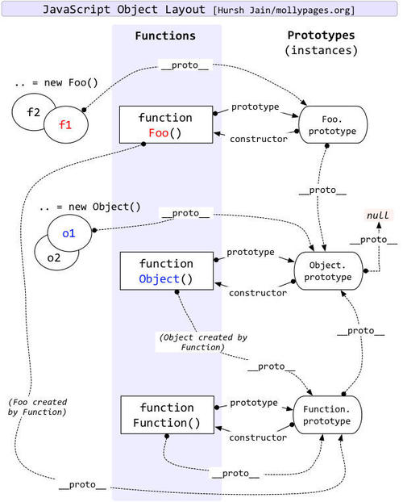

## 变量

关键词：var---声明一个变量，开辟一块空间，用来存储数据

**不使用关键词进行声明，会自动变成全局变量，挂载到windows里面去**（相当于垃圾）

### 声明变量的各种情况：

​		1.只声明不赋值

​		2.先声明后赋值

​		3.声明变量并同时赋值

​		4.同时定义多个变量，用逗号隔开

### 变量的命名规则：

​		1.严格区分大小写

​		2.见名知意

​		3.不能以数字开头，只能包含字母、数字   _    $

​		4.不能使用中文

​		5.不能使用关键词和保留字

​			关键词：js已经赋予特殊功能的单词

break、case、catch、continue、debugger(第五版新增关键字)、default、delete、do、else、finally、for、function、if、in、instanceof、new、return、switch、this、throw、try、typeof、var、void、while、with

​			保留字：js预定未来可能要用的单词(ECMA-262第三版定义的保留字)

abstract、boolean、byte、char、class、const、debugger、double、enum、export、extends、final、float、goto、implements、import、int、interface、long、native、package、private、protected、public、short、static、super、synchronized、throws、transient、volatile

​		   //top也属于保留字

变量命名规范：使用驼峰命名 

## 常量

定义常量：const

​				例：const x = 3.1415926;

注意：**常量一旦定义，就不能再更改，重新赋值，只能用来使用**

常量命名规范：全字母大写加下划线_拼接    //示例：MAX_NUMBER

## 数据类型

ES5数据类型：6个

基础数据类型：5个

​		1.number---数值型

​		2.string---字符串

​		3.boolean---布尔值：true / flase---判断

​		4.null---空---含义：空对象

​		5.undefined---未定义

复杂数据类型：1个

​				object---对象

检测数据类型---typeof   变量名 / typeof(变量名)

### number

特殊：NaN---not a number ,如: 0 / 0   ,   a / 0

NaN不等于任何值，包括它本身。

isNaN()方法可以用来判断一个值是否为NaN。它只对数值有效，如果传入其他值，会先转成数值。比如传入字符串，字符串会被先转成NaN，返回true，同样的，数组和对象也会返回true。对于空数组和只有一个数组成员的数组，会返回false。

数值进制：

​		普通数字为十进制

​		八进制：以0 / 0o / 0O开头的数字，字面量就是八进制，八进制只能包含0~7

​		十六进制：以0x / 0X开头的数字，字面量就是十六进制，十六进制包含数字0-9youx和a-f / A-F

浮点数就是小数

指数就是允许使用e来表示乘以10的几次幂，如console.log(5e5); 就是500000

由于浮点数不是精确的值，所以涉及小数的比较和运算要特别小心

```js
console.log(0.1+0.2);  //0.3000000000000004
```

**Infinity**表达式的计算结果太大或太小，超出能够表示的范围，因此返回Infinity。而非0数值除以0，也会返回Infinity，如：1/0

Infinity有正负之分，Infinity表示正的无穷，-Infinity表示负的无穷	

Infinity大于一切数值(除了NaN)，-Infinity小于一切数值(除了NaN).

isFinite()方法返回一个布尔值，表示某个值是否为正常的数值。除了Infinity、-Infinity、NaN和undefined这几个值会返回false，其他数值都会返回true。

### undefined

出现场景：

​	1.变量被声明了，但没有赋值时，就等于undefined

​	2.调用函数时，应该提供的参数没有提供，该参数等于undefined

​	3.对象没有赋值的属性，该属性的值为undefined

​	4.函数没有返回值时。默认返回undefined。

### string

字符串是由0或是多个字符组成的字符序列,即字符串;

字符串可以用双引号(“”)或是单引号(‘’)或模板字符串(``)包裹起来。

如果一个数字，用引号引起来，那么就是字符串了。不加引号是错误的，注意引号必须是同种引号，混用错误。

### boolean

布尔（逻辑）只能有两个值：true 或 false。

除了undefined、null、false、0、NaN、""或''或 ``（空字符串）被转为false，其他值都视为true。

### null

null表示空，它是一个空对象指针，undefined则表示未定义。

typeof检测不出，检测出的结果是object

undefined值派生自null值的，所以undefined==null的返回结果是true。

### Object 

#### Array 数组 

数组（array）是按次序排列的一组值。每个值的位置都有编号 （从0开始），整个数组用方括号表示。

清空数组的一个有效方法，就是将length属性设为0。

除了在定义时赋值，数组也可以先定义后赋值。

```js
var arr = [];
arr[0] = 'a'; arr[1] = 'b'; arr[2] = 'c';
```

数组的嵌套取值 
	如果数组的元素还是数组，就形成了多维数组

#### object 对象数据(狭义的对象)

对象是一组键值对的集合 , 是一种无序的复合数据集合

对象所有的属性名都是字符串,加引号和不加引号都可以 除非不符合标识符的规则，比如第一个字符为数字含有空格或运算符

属性值可以是任何数据类型

每一个属性名被称为属性,如果一个属性名的值是函数,则这个属性称为方法

属性之间用逗号分隔 , 最后一个属性可加可不加

属性名不能相同 属性值能相同

**对象取值**

```js
console.log(lindaiyu.name); 
console.log(lindaiyu.age);
```

**对象修改**

```js
lindaiyu.marry = true 
console.log(lindaiyu.marry);
```

**添加新属性**

```js
lindaiyu.hobby = "怼人"; 
console.log(lindaiyu); 
//属性可以动态的创建和添加 不必在对象声明时全部指定
```

**对象删除**

```js
delete lindaiyu.age 
console.log(lindaiyu);
// = 赋值操作不能删除对象属性
```

**内置对象,节点对象** 

内置对象(js提前帮你定义好的对象)
节点对象(通过去获取的元素)

```js
console.log(window); 
//内置window对象,里面少读属性只读, 大部分可读可写 
console.log(document);
```

#### 函数对像

函数是一段可以反复调用的代码块
把一堆代码封装起来,不会立马去执行。

#### 判断对象内容是否一致

```js
isObjectEqual(a, b) {
  // 判断两个对象是否指向同一内存，指向同一内存返回true
  if (a === b) return true
  // 获取两个对象键值数组
  let aProps = Object.getOwnPropertyNames(a)
  let bProps = Object.getOwnPropertyNames(b)
  // 判断两个对象键值数组长度是否一致，不一致返回false
  if (aProps.length !== bProps.length) return false
  // 遍历对象的键值
  for (let prop in a) {
    // 判断a的键值，在b中是否存在，不存在，返回false
    if (b.hasOwnProperty(prop)) {
      // 判断a的键值是否为对象，是则递归，不是对象直接判断键值是否相等，不相等返回false
      if (typeof a[prop] === 'object') {
        if (!this.isObjectEqual(a[prop], b[prop])) return false
      } else if (a[prop] !== b[prop]) {
        return false
      }
    } else {
      return false
    }
  }
  return true
}
```

## 数据类型转换

### number类型转换

1.数值---返回对应数字

  若传入其它进制数---返回对应十进制数

2.布尔值--- true->1  /  false-> 0

3.null---返回0

4.undefined---返回NaN

5.字符转number

①字符中值包括数字（包括前边有正负号的情况）如果前面有0，0被忽略

```js
Number("001223") // 1223
Number("+12")    // 12
Number("-015")   // -15
```

②如果字符串中包含有效的浮点数，将其转换成对应的浮点数值

```js
Number("11.22")  // 11.22
Number("00.22")  // 0.22
```

③如果字符串中包含有效的16进制--转换成相同大小的10进制数值

```js
Number("0xf")  // 15
```

④如果字符串是空则转化为 0

⑤如果字符串包含上述格式之外的字符，将其转换成NaN

```js
Number("11.无效")     // NaN
Number("汉字 01.15")  // NaN
```

6.**parseInt()**

①他会忽略字符串前边的空，直至找到第一个非空字符，如果第一个字符是数字字符,parseInt()会继续解析第二个字符，直到解析完后续的字符或遇到一个非数字字符

```js
parseInt("  123")         // 123
parseInt("      汉字456")  // NaN
```

②如果第一个字符不是数字字符或符号，则返回 NaN

```js
parseInt("+456pt")  //456
parseInt("汉字13")  //NaN
parseInt("-245")    // -245
```

③如果解析的值是一个小数或者字符串开头是的小数，只会截取整数部分

```js
parseInt("000.1400561") // 0
parseInt(1.23)			// 1
parseInt("0.999")		// 0
```

7.**parseFloat()**

parseFloat() 和 parseInt() 唯一的区别就是他可以解析出小数

```js
parseFloat(111.222)  //111.222
parseFloat("11.22.33") //11.22
```

### string类型转换

1.toString

①数字转换成字符串不能直接数字.toString(),而是需要把一个数字存到一个变量，然后变量.toString()实现转换

```js
var str = 111;
var a = str.toString();
console.log(a);		// 111
```

②数组转换成字符串，只需要一个个拆分出来就好了

```js
var aa = ["hellow","xiao","1"];
console.log(aa.toString());  // hellow,xiao,1
```

③如果是嵌套数组，先解析小数组，再解析大数组

```js
var b = [1,"2",["ww","22"]];
console.log(b.toString());  //1,2,ww,22
```

④函数转为字符串，则将函数完整的代码输出出来

```js
function fn(){alert(1)}
console.log(fn.toString()); //function fn(){alert(1)}
```

⑤对象转为字符串直接一个表示符[object Object]

```js
var obj = {x: 111, y: "哎"};
console.log(obj.toString());  // [object Object]
```

⑥布尔值转换字符串的结果就是相对应的字符串

```js
console.log(true.toString(),false.toString());  //结果：true false
```

**null和undefined值不支持toString()方法，但可以使用String()方法**

2.String()

```js
var zz = null,xx = undefined;
console.log(String(zz),String(xx));   //null undefined
```

### Boolean类型转换

| 数据类型  | 转换为true的值            | 转化为flase的值 |
| :-------- | :------------------------ | :-------------: |
| boolean   | ture                      |      false      |
| string    | 任何非空字符串            | “”（空字符串）  |
| number    | 任何非0数值（包括无穷大） |     0 和NaN     |
| object    | 任何对象                  |      null       |
| undefined | \                         |    undefined    |

## 运算符

### 一元运算符

1.+

​	+ 放在数值前，不会产生任何影响，放在非数值前，就用调用Number() -- 转换成数值

2.-

放在 数值 前，表示负数，放在非数值前，就会调用 Number() -- 转换成数值，或者转化成负数

3.++

​	a++：先赋值，再自生运算加1

​	++a: 先自生运算+1，再赋值

4.--

​	a--：先赋值，再自生运算- 1

​	--a：先自生运算-1，再赋值

5.a++ 和 ++a 的区别

​	a++: 参与运算---不会先自己 +1，运算完了，再给自己 + 1

​	++a: 先给自己 +1，再参与运算

### 二元运算符

1.加法 -- 特殊 拼接
    ①操作数两个都是数值-常规的加法计算,如果有一个操作数是NaN,则结果也是NaN
    ② 如果两个操作数都是字符串,就是将两个操作数拼接起来
    ③ 如果只有一个操作数是字符串,则将另一个操作数转换为字符串,然后再拼接起来

​	④如果有一个操作数是对象,数值,布尔值，则调用他们的toString()方法，取得相对应的字符串，然后再进行前边的规则

对于 undefined --- Number()，取得数字，再参与计算  undefined - NaN

对于 null  --- Number()，取得数字，再参与计算  null - 0

2.减性操作符: 

            *   在进行作数也会进行数据类型转换，是把所有类型的数据先转换为数字类型再计算，不能直接转数字的就先转换成字符串再转成数字

1. 如果有一个操作数是字符串，布尔值，null或者undefined，则先后台调用Number函数转换成数值， 然后根据规则执行减法计算，如果转换结果是NaN，则减法结果就是NaN
2. 如果有一个操作数是对象,则调用对象的valueOf()取得表示该对象的数值,如果得到的值是NaN,结果就是NaN，如果对象没有valueOf()方法，则调用他的toString()方法，得到字符串转换为数值

### 关系运算符

1. ==  如果两个操作数相等，返回true

2. !=   如果两个操作数不等，返回true

   比较相等性之前，不能把null和undefined转换成其他任何值，null和undefined相等

   NAN和任何数都不相等，包括它本身

3. ===  数据类型一致，值完全一致，全等
4. !==  全非

### 条件操作符

A ? B : C    A为真，则选B，反之选C

```js
max = a > b ? a : b   // a>b，则max=a，否则max=b
```

### 逻辑运算符

1.&&  遇到false就会停下来，并返回值，全部满足返回true，并且返回最后一个true

2.||    遇到true就会停下，并返回值，全部满足false就会返回最后一个false

3.!       结果的对立面

## if语句

1.if（条件）{条件为真的代码块}

```js
var a = prompt("你的女朋女是"); // prompt输入框
if （a === "目戈元"）{
	alert（“*********”）；
}
```

2.if（条件）{条件为真的代码块} else{条件为假的代码块}

```js
 var a = prompt("你喜欢的");
 if(a === "棋羽少年"){
 	alert("哈哈哈哈");
 }else{
 	alert("!!!!!!!!!");
 }
```

3.多个if else == switch

```js
switch(a){
	case "qiyu":
		alert("11");
	break;	//跳出
	case "shainian":
		alert("111");
	break;
	case "11":
		alert("111");
	break;
	default:	//默认值
		alert("22222");
	break;
}
```

## for循环

for（初始条件1；判断语句；语句1）{

​	核心代码

}

for（1初始表达式；2条件；3增量/减量/其他表达式）{

​	4循环要做的事情

}

**注意：执行顺序1--->2--->4---->3**

```js
var i = 0；
for ( ; i < 3 ; ){
 	console.log(i);
	i++;
}
```

### break与 continhue

```js
for(var i = 0; i < 10; i++){
	if (i === 5){
	//break;	//跳出循环，结束循环，break之后的代码不会执行了  0 1 2 3 4
	continue;	//跳过当前的循环，继续执行  0 1 2 3 4 6 7 8 9
}
```

**for…in循环读取键名，for…of循环读取键值**

### for-in循环

主要应用于对象

for（var 变量 in 对象/数组）{

​	语句1；

}

①如果是对象的话，变量代表键名

②如果是数组的话，变量代表下标

```js
var a = ["a","b","c","d"];
var b = {
    aaa: "aa",
    bbb: "bb"
}
for(var i in a){
    console.log(i);	//下标
    console.log(a[i]);  //数组元素
 }
for(var i in b){
    console.log(i); // i 是aaa，bbb
}
```

### for-of循环

for…of循环可以使用的范围包括数组、Set 和 Map 结构、某些类似数组的对象（比如arguments对象、DOM NodeList 对象）、后文的 Generator 对象，以及字符串。

不能用于纯对象

```js
var arr = ['a', 'b', 'c', 'd'];
 for (let a of arr) {
     console.log(a); // a b c d
 }
```

## while循环

while：先判断在执行

do while：先执行在判断

```js
var i = 5;
do{
	console.log("我是1+++" + i);
	i++;	//i==6
}while(i < 4);//先做一遍再执行
//我是1+++5

var i = 0；
while(i< 3){
	console.log("我是" + i);
	i++;
}
//我是0
//我是1
//我是2

```

## 闭包

闭包函数：声明在一个函数中的函数，叫做闭包函数。

闭包：内部函数总是可以访问其所在的外部函数中声明的参数和变量，即使在其外部函数被返回（寿命终结）了之后。

### 特点

1.  让外部访问函数内部变量成为可能；

2. 局部变量会常驻在内存中；

3. 可以避免使用全局变量，防止全局变量污染；

4. 会造成内存泄漏（有一块内存空间被长期占用，而不被释放）

```js
function outerFn(){
  var i = 0; 
  function innerFn(){
      i++;
      console.log(i);
  }
  return innerFn;
}
//每次外部函数执行的时候,都会开辟一块内存空间,外部函数的地址不同，都会重新创建一个新的地址
var inner = outerFn();  
inner();  //1
inner();  //2
inner();  //3
var inner2 = outerFn();
inner2();   //1
inner2();   //2
inner2();   //3
```

for循环中的使用

```js
 var ap = document.getElementsByTagName("p");

   for (var i = 0; i <ap.length ; i++) { 
	(function(i){ 
		ap[i].onclick= function(){ 
			console.log(i); 
		}
	})(i)
   }


	for (var i = 0; i < ap.length ; i++) {
		ap[i].onclick = function(i){
			return function(){
				console.log(i)
			}
		}(i)
	}
```

## 防抖节流

### 防抖

对于短时间内连续触发的事件，防抖的含义就是让某个时间期限内，事件处理函数只执行一次。

```js
function debounce(fn,delay){
  let timer = null;  //采用闭包
  return function () {  
    if(timer) clearTimeout(timer);
    timer = setTimeout(fn,delay)
  }
}
function showTop(){
    var scrollTop = document.body.scrollTop || document.documentElement.scrollTop;
    console.log('滚动位置: ' + scrollTop );
  }
window.onscroll = debounce(showTop,1000);

<!--    常规写法    -->
var timer;
document.getElementById("xxxx").onscroll = function(){
    clearTimeout(timer); // 清除未执行的代码，重置回初始化状态
    timer = setTimeout(function(){
        console.log("函数防抖");
    }, 300);
};
```

### 节流

如果短时间内大量触发同一事件，那么**在函数执行一次之后，该函数在指定时间期限内不再工作**，直至过了这段时间才重新生效

```js
function throttle(fn,delay){
  let a = true;
  return function(){
    if(!a){
      return false;
    }
    a = false;
    setTimeout(() => {
      fn();
      a = true;
    },delay)
  }
}
function showTop(){
    var scrollTop = document.body.scrollTop || document.documentElement.scrollTop;
    console.log('滚动位置: ' + scrollTop );
  }
window.onscroll = throttle(showTop,1000);
```

## 浅拷贝和深拷贝

### 浅拷贝

被复制对象的所有变量都含有与原来对象相同的值，而所有其他对象的引用仍然指向原来的对象。换言之，浅复制仅仅复制所考虑的对象，而不复制它所引用的对象。

```js
var arr = [];
var arr1 = [1,2,3];
arr = arr1;
console.log(a===b); //true
arr[0]=2;
console.log(a); //[2,2,3]
console.log(b); //[2,2,3]

var a={};
var b={
  name:'aaa',
  age:18
}
a=b;
a.name = 'bbb'
console.log(b.name); // bbb
```

JS中数据对于存储可以分为两种数据类型：**基本类型**和**引用类型**
**基本类型：Number，String，Boolean，Null，Undefined**
这些类型的值存放在栈区，函数调用时传递的是变量的值(值)。

> 注意：这些数据类型直接 “=” 拷贝，修改另一个变量的值不会影响其他变量的值

**引用类型：Object，Array，Function**
这些类型的对象存放在堆区，对象的地址存放在栈区，函数调用时传递的是对象的地址(址)。

> 注意：这些数据类型 “=” 拷贝，拷贝的是引用地址，所以修改变量其中的值会更改拷贝变量其中的值

### 深拷贝

被复制对象的所有变量都含有与原来对象相同的值，除去那些引用其他对象的变量。那些引用其他对象的变量将指向被复制的新对象，而不再是原有的那些被引用的对象。换言之，深复制把复制的对象所引用的对象都复制了一遍。

assign和slice方法只是进行第一层的深拷贝，更深的属性却仍然公用了地址。

```js
//assign
var a=[1,2,[3,4],5];
var b=[];
Object.assign(b,a);
a[2][0] = 2;
console.log(a); //[1,2,[2,4],5]
console.log(b); //[1,2,[2,4],5]
//slice
let a=[0,1,[2,3],4],
    b=a.slice();
a[2][0]=1;
console.log(a);  //[0, 1, [1, 3], 4]
console.log(b);  //[0, 1, [1, 3], 4]
```

真正的深拷贝：

```js
// 递归方法
function deepClone(obj){
    let objClone = Array.isArray(obj)?[]:{};
    if(obj && typeof obj==="object"){
        for(let key in obj){
            //hasOwnProperty判断obj是否有某属性，有返回true，否则false
            if(obj.hasOwnProperty(key)){
                //判断obj子元素是否为对象，如果是，递归复制
                if(obj[key] && typeof obj[key] ==="object"){
                    objClone[key] = deepClone(obj[key]);
                }else{
                    //如果不是，简单复制
                    objClone[key] = obj[key];
                }
            }
        }
        return objClone;
    }
    return obj;
}    
let a=[1,2,[3,5],4],
    b=deepClone(a);
a[2][0]=2;
console.log(a);  //[1, 2, [2, 5], 4]
console.log(b);  //[1, 2, [3, 5], 4]

// JSON对象的parse和stringify方法 (undefined不能拷贝)
function deepClone(obj){
    let _obj = JSON.stringify(obj),
        objClone = JSON.parse(_obj);
    return objClone
}    
let a=[0,1,[2,3],4],
    b=deepClone(a);
a[0]=1;
a[2][0]=1;
console.log(a); //[1, 1, [1, 3], 4]
console.log(b); //[0, 1, [2, 3], 4]

//利用jQuery的extend方法 (基本数据类型都不能进行拷贝，只能进行引用数据类型深拷贝)
//记得引入jQuery
/*
$.extend( [deep ], target, object1 [, objectN ] )
 deep表示是否深拷贝，为true为深拷贝，为false，则为浅拷贝
 target Object类型 目标对象，其他对象的成员属性将被附加到该对象上。
 object1  objectN可选。 Object类型 第一个以及第N个被合并的对象。 
*/
let a=[0,1,[2,3],4],
    b=$.extend(true,[],a);
a[0]=1;
a[2][0]=1;
console.log(a); //[1, 1, [1, 3], 4]
console.log(b); //[0, 1, [2, 3], 4]
```

## 面向对象

1.对象：对象是一个整体，对外提供一些操作。

2.面向对象：使用对象时，只关注对象提供的功能，不关注其内部细节。比如电脑——有鼠标、键盘，我们只需要知道怎么使用鼠标，敲打键盘即可，不必知道为何点击鼠标可以选中、敲打键盘是如何输入文字以及屏幕是如何显示文字的。总之我们没必要知道其具体工作细节，只需知道如何使用其提供的功能即可，这就是面向对象。

```js
function People(n,a){
      this.name = n;
      this.age = a;
      this.sayName = function () {
           console.log(this.name)
      }
}
/* new 后边跟的是 函数()
	1. 函数内部会自动创建一个全新的对象,函数内部的this指向的是这个对象
	2. 函数默认返回值不再是 undefined ,而是这个对象
  通过 new 执行的这种函数 --- 称为 构造函数 (类)
  通过 new 得到对象的过程, 我们称之为"实例化",而得到的每个对象我们称之为"实例"
*/
let nope = new People("Nope",66);
let han = new People("寒寒",30);
/*对象 han 是构造函数 People的一个实例*/
nope.sayName();
han.sayName();
--------------------------------------------------------------------------
/*做的事情都一样，为了不让构造函数每次都定义不同的Function实例，所以将sayName函数放在了构造函数外面*/
function fn(){
    console.log(this.name)
}
function People(n,a){
    this.name = n;
    this.age = a;
    this.sayName = fn;
}
console.log( nope.sayName === han.sayName ); // true，它们指向的是同一个地址所以为true
```

## 原型

任何一个对象都有原型，我们可以通过非标准属性 `__proto__` 来访问一个对象的原型。

实例的隐式原型就是它的构造函数的原型

```js
function People(n,a){
    this.name = n;
    this.age = a;
}
/*People 是一个函数对象,所有的函数里边都有一个 prototype
   将相同的操作放在prototype中，其中的this指向的就是它们自己的实例
*/
People.prototype.sayName = function(){
   console.log(this.name)
};
let nope = new People("Nope",66);
let han = new People("寒寒",30);
console.log( nope.__proto__ === People.prototype );// true
console.log( nope.sayName === han.sayName );//true
console.log( han.__proto__ === nope.__proto__); //true
nope.sayName(); //Nope
han.sayName();  //寒寒
```

## 原型链

当访问一个对象的某个属性时，会先在这个对象本身属性上查找，如果没有找到，则会去它的__proto__隐式原型上查找，即它的构造函数的prototype，如果还没有找到就会再在构造函数的prototype的__proto__中查找，这样一层一层向上查找就会形成一个链式结构，我们称为原型链。

> 正常的原型链都会终止于Object的原型对象，Object原型的原型是null

所有的原型对象都会自动获得constructor属性，这个属性指向与之关联的构造函数

> 如Person.prototype.constructor指向Person，person1.`__proto__`.constructor指向Person



## 继承

在父类的基础上继承子类，子类拥有父类的一切并且子类可以扩展新的属性,，扩展的新的属性是不影响父类的

```js
function Person(n,a) {
     // 类里边有私有属性
     this.name = n;
     this.age = a;
}
//原型--公共方法
Person.prototype.sayName = function () {
   console.log(this.name)
};
Person.prototype.sayAge = function () {
   console.log(this.age)
};
// 从 父类的基础上 继承子类Teacher
function Teacher(n,a,id) {
   // 让Person里name 和age 在这里
   // 构造函数私有属性的继承
   Person.call(this,n,a);
   // 新增的私有属性--直接写
   this.id = id;
};
//这样继承没办法继承父类的原型方法，所以直接让子类.prototype=父类.prototype
Teacher.prototype = Person.prototype;
//这样就造成了另一个问题，子类原型新增方法会影响到父类原型方法
Teacher.prototype.sayId = function () {
    console.log( this.id )
};
//父类的原型中也会出现sayId这个方法，这是不可取的
```

直接继承原型会影响父类的原型方法，创造一个中间人来进行原型的继承

```js
function Person(n,a) {
	this.name = n;
    this.age = a;
}
//原型--公共方法
Person.prototype.sayName = function () {
   console.log(this.name)
};
Person.prototype.sayAge = function () {
    console.log(this.age)
};
// 从 父类的基础上 继承子类Teacher
function Teacher(n,a,id) {
    Person.call(this,n,a);
    // 新增的私有属性--直接写
    this.id = id;
};
// 原型的继承
function F(){}; // 中间人
F.prototype = Person.prototype;
Teacher.prototype = new F();
Teacher.prototype.constructor = Teacher;
// 新增原型
Teacher.prototype.sayId = function () {
   console.log( this.id )
};
```

继承封装一下(完整版)

```js
function extend(CLASS) {
    function F() {};
    F.prototype = CLASS.prototype;
    return new F();
}
function Person(n,a) {
    this.name = n;
    this.age = a;
}
Person.prototype.sayName = function () {
    console.log(this.name)
};
Person.prototype.sayAge = function () {
    console.log(this.age)
};
function Teacher(n,a,id) {
    Person.call(this,n,a);
    this.id = id;
};
// 原型的继承
Teacher.prototype = extend(Person);
Teacher.prototype.constructor = Teacher;
// 新增原型
Teacher.prototype.sayId = function () {
     console.log( this.id )
};
```

## 数组方法

### push

- 语法: array.push(item1, item2, …, itemX)

- push( )方法：可以将一个或者更多的参数添加在数组的尾部；返回添加后的数组的长度，原数组发生改变。

  ```js
  var arr=[1,2,3,4];
  var a=arr.push(9,8,7);
  console.log(a,arr);//1,2,3,4,9,8,7；
  ```

### unshift

- 语法: array.unshift(item1,item2, …, itemX)

- unshift( )方法：可以将一个或者更多的参数添加在数组的头部；返回添加后的数组的长度，原数组发生改变。

  ```js
  var arr=[1,2,3,4];
  var a=arr.unshift(9,8,7);
  console.log(a,arr);//9,8,7,1,2,3,4；
  ```

### pop

- 语法：array.pop()

- pop( )方法：从数组尾部删除一个元素，返回这个被删除的元素，原数组发生改变。

  ```js
  var arr=[1,2,3,4];
  var a=arr.pop();
  console.log(a,arr)//4；1,2,3
  ```

### shift

- 语法：array.shift()

- shift( ) 方法：从数组头部删除一个元素，返回这个被删除的元素，原数组发生改变。

  ```js
  var arr = [1,2,3,4];
  var a = arr.shift();
  console.log(a,arr)//1,2,3,4，
  ```

### slice

- 语法：array.slice(start, end)

- slice（）方法：如果不传参数，会返回原数组；如果一个参数，从该参数表示的索引开始截取，直至数组结束，返回这个截取数组，原数组不变；

  两个参数，从第一个参数对应的索引开始截取，到第二个参数对应的索引结束，但包括第二个参数对应的索引上的值，原数组不改变 &最多接受两个参数

  ```js
  var fruits = ["Banana", "Orange", "Lemon", "Apple", "Mango"];
  var citrus = fruits.slice(1,3);
  console.log(citrus )//Orange,Lemon
  ```

### splice

- 语法：array.splice(index,howmany,item1,…,itemX)

- splice( ) 方法：没有参数，返回空数组，原数组不变；
  一个参数，从该参数表示的索引位开始截取，直至数组结束，返回截取的 数组，原数组改变；

  两个参数，第一个参数表示开始截取的索引位，第二个参数表示截取的长度，返回截取的 数组，原数组改变；
  三个或者更多参数，第三个及以后的参数表示要从截取位插入的值。

  ```js
  var fruits = ["Banana", "Orange", "Apple", "Mango"];
  fruits.splice(2,2);
  console.log(fruits )//Banana,Orange
  ```

### reverse

- 语法：array.reverse()

- reverse( )方法：用于颠倒数组中元素的顺序。

  ```js
  var fruits = ["Banana", "Orange", "Apple", "Mango"];
  fruits.reverse();
  console.log(fruits)//Mango,Apple,Orange,Banana
  ```

### sort

- 语法：array.sort(sortfunction)

- sort( ) 方法：用于对数组的元素进行排序。

  ```js
  var Array = [1,2,3,4,5];
  var fruits = Array.sort(function(a,b){
  	//return a - b; //从小到大
  	return b-a; //从大到小
  })
  ```

### join

- 语法：array.join(separator)

- join( ) 方法：于把数组中的所有元素转换一个字符串,元素是通过指定的分隔符进行分隔的。

  ```js
  var arr = [1,2,3,4]
  var bbc = arr.join()
  console.log(bbc)//1,2,3,4
  ```

### concat

- 语法：string.concat(string1, string2, …, stringX)

- concat( ) 方法：属于字符串的方法，数组也可以用，接受一个或多个参数，将参数中的值放到操作的数组后边，返回拼接的数组，原数组不变。如果参数是一个数组，则先把值提取出来再操作。

  ```js
  var arr = [1,2,3,4];
  arr.concat([5,6,7])//[1,2,3,4,5,6,7]
  ```

## ES5新增的一些数组方法

### indexOf

- 语法：string.indexOf(searchvalue,start)

- indexOf( ) 方法：字符串的方法，数组也可适用，此方法可返回某个指定的字符串值在字符串中首次出现的位置；若一个参数，返回这个参数在数组里面的索引值，如果参数不在操作的数组中，则返回 -1。

  ```js
  var arr = [1,2,3,4];
  arr.indexOf(1) // 0
  arr.indexOf(5) // -1 
  ```

### forEach

- 语法：array.forEach(function(currentValue, index, arr), thisValue)

- forEach( ) 方法：数组遍历，且只能够遍历数组，不接受返回值或返回值为 undefined。

  ```js
  var arr = [1,2,3,4,5];
  arr.forEach((item,index,arr)=>{
     //item 为当前数组元素
     // index 为当前索引
     // arr 为数组名字
  })
  ```

### map

- 语法：array.map(function(currentValue,index,arr), thisValue)

- map( ) 方法：数组的遍历，用来接收一个返回值，创建一个新数组，不改变原数组。

  ```js
  var arr = [1,2,3,4,5,6];
  arr.map(function(item,index,arr){
  	return item * 2
  })
  //输出 [2,4,6,8,10,12]
  ```

### filter

- 语法：array.filter(function(currentValue,index,arr), thisValue)

- filter( ) 方法：过滤出一些符合条件的元素，返回一个新数组。

  ```js
  var ages = [32, 33, 16, 40];
  
  function checkAdult(age) {
      return age >= 18;
      //返回数组 ages 中所有元素都大于 18 的元素:
  }
  function myFunction() {
      document.getElementById("demo").innerHTML = ages.filter(checkAdult);
  }
  //输出结果为：32,33,40
  ```

### some

- 语法：array.some(function(currentValue,index,arr),thisValue)

- some( ) 方法：检测数组中是否含有某一个值，返回一个布尔值，如果数组中有任意一个元素满足给定的条件，结果就为 true否则则为false。

  ```js
  var ages = [3, 10, 18, 20];
  
  function checkAdult(age) {
      return age >= 18;
  }
  function myFunction() {
      document.getElementById("demo").innerHTML = ages.some(checkAdult);
  }
  //输出结果为：true
  ```

### every

- 语法：array.every(function(currentValue,index,arr), thisValue)

- every( ) 方法：方法用于检测数组所有元素是否都符合指定条件（通过函数提供）,返回一个布尔值,结果为 true或false。

  ```js
  var ages = [32, 33, 16, 40];
  
  function checkAdult(age) {
      return age >= 18;
      //检测数组 ages 的所有元素是否都大于等于 18 
  }
  
  function myFunction() {
      document.getElementById("demo").innerHTML = ages.every(checkAdult);
  }
  //输出结果为：false
  ```

### reduce

- 语法：array.reduce(function(total, currentValue, currentIndex, arr), initialValue)

- reduce( ) 方法：对数组中的所有元素调用指定的回调函数，该回调函数的返回值为累计结果。并且把返回值在下一次回调函数时作为参数提供。

  ```js
  var numbers = [65, 44, 12, 4];
   
  function getSum(total, num) {
      return total + num;
      //计算数组相加的总和
  }
  function myFunction(item) {
      document.getElementById("demo").innerHTML = numbers.reduce(getSum);
  }
  //输出结果为：125
  ```

## ES6新增的数组方法

### Array.from

- 语法：Array.from(arrayLike[, mapFn[, thisArg]])

- Array.from( ) 方法：将类数组对象或可迭代对象转化为数组，比如arguments，js选择器找到dom集合和对象模拟的数组。

  ```js
  // 参数为数组,返回与原数组一样的数组
  console.log(Array.from([1, 2])); // [1, 2] 
  // 参数含空位
  console.log(Array.from([1, , 3])); // [1, undefined, 3]
  ```

### Array.of

- Array.of( ) 方法：数组创建，将参数中所有值作为元素形成数组，如果参数为空，则返回一个空数组。

  ```js
  console.log(Array.of(1, 2, 3, 4)); // [1, 2, 3, 4] 
  // 参数值可为不同类型
  console.log(Array.of(1, '2', true)); // [1, '2', true] 
  // 参数为空时返回空数组
  console.log(Array.of()); // []
  ```

### find

- find( ) 方法：查找数组中符合条件的元素,若有多个符合条件的元素，则返回第一个元素。

  ```js
  let arr = Array.of(1, 2, 3, 4);
  console.log(arr.find(item => item > 2)); // 3 
  // 数组空位处理为 undefined
  console.log([, 1].find(n => true)); // undefined
  ```

### findIndex

- 查找数组中符合条件的元素索引，若有多个符合条件的元素，则返回第一个元素索引。

  ```js
  let arr = Array.of(1, 2, 1, 3);
  // 参数1：回调函数
  // 参数2(可选)：指定回调函数中的 this 值
  console.log(arr.findIndex(item => item == 1)); // 0
  // 数组空位处理为 undefined
  console.log([, 1].findIndex(n => true)); //0
  ```

### includes

- includes( ) 方法：检测数组中是否包含一个值。

- 注意：与 Set 和 Map 的 has 方法区分；Set 的 has 方法用于查找值；Map 的 has 方法用于查找键名。

  ```js
  // 参数1：包含的指定值
  [1, 2, 3].includes(1);    // true
  // 参数2：可选，搜索的起始索引，默认为0
  [1, 2, 3].includes(1, 2); // false
  // NaN 的包含判断
  [1, NaN, 3].includes(NaN); // true
  ```

### fill

- fill( ) 方法：将一定范围索引的数组元素内容填充为单个指定的值。

  ```js
  let arr = Array.of(1, 2, 3, 4);
  // 参数1：用来填充的值
  // 参数2：被填充的起始索引
  // 参数3(可选)：被填充的结束索引，默认为数组末尾
  console.log(arr.fill(0,1,2)); // [1, 0, 3, 4]
  ```

### entries

- entries( ) 方法：遍历键值对。

  ```js
  for(let [key, value] of ['a', 'b'].entries()){
      console.log(key, value);
  }
  // 0 "a"
  // 1 "b" 
  // 不使用 for... of 循环
  let entries = ['a', 'b'].entries();
  console.log(entries.next().value); // [0, "a"]
  console.log(entries.next().value); // [1, "b"]
   
  // 数组含空位
  console.log([...[,'a'].entries()]); // [[0, undefined], [1, "a"]]
  ```

### keys

- keys( ) 方法：遍历键名。

  ```js
  for(let key of ['a', 'b'].keys()){
      console.log(key);
  }
  // 0
  // 1 
  // 数组含空位
  console.log([...[,'a'].keys()]); // [0, 1]
  ```

### values

- values( ) 方法：遍历键值。

  ```js
  for(let value of ['a', 'b'].values()){
      console.log(value);
  }
  // "a"
  // "b"
  // 数组含空位
  console.log([...[,'a'].values()]); // [undefined, "a"]
  ```

### flat

- 嵌套数组转一维数组

  ```js
  console.log([1 ,[2, 3]].flat()); // [1, 2, 3] 
  // 指定转换的嵌套层数
  console.log([1, [2, [3, [4, 5]]]].flat(2)); // [1, 2, 3, [4, 5]] 
  // 不管嵌套多少层
  console.log([1, [2, [3, [4, 5]]]].flat(Infinity)); // [1, 2, 3, 4, 5]
  // 自动跳过空位
  console.log([1, [2, , 3]].flat());<p> // [1, 2, 3]
  ```

### 复制数组

- …   扩展运算符

  ```js
  let arr = [1, 2],
      arr1 = [...arr];
  console.log(arr1); // [1, 2]
   
  // 数组含空位
  let arr2 = [1, , 3],
      arr3 = [...arr2];
  console.log(arr3); [1, undefined, 3]
  //合并数组
  console.log([...[1, 2],...[3, 4]]); // [1, 2, 3, 4]
  ```

## 数组去重

### 利用ES6 Set去重

不考虑兼容性，这种去重的方法代码最少。这种方法还无法去掉“{}”空对象.

```js
function unique (arr) {
  return Array.from(new Set(arr))
}
var arr = [1,1,'true','true',true,true,15,15,false,false, undefined,undefined, null,null, NaN, NaN,'NaN', 0, 0, 'a', 'a',{},{}];
console.log(unique(arr))
 //[1, "true", true, 15, false, undefined, null, NaN, "NaN", 0, "a", {}, {}]
-------------------------------------------------------------------------
[...new Set(arr)]
```

### 利用for嵌套for，然后splice去重

NaN和{}没有去重，两个null直接消失了

```js
function unique(arr){            
        for(var i=0; i<arr.length; i++){
            for(var j=i+1; j<arr.length; j++){
                if(arr[i]==arr[j]){         //第一个等同于第二个，splice方法删除第二个
                    arr.splice(j,1);
                    j--;
                }
            }
        }
return arr;
}
var arr = [1,1,'true','true',true,true,15,15,false,false, undefined,undefined, null,null, NaN, NaN,'NaN', 0, 0, 'a', 'a',{},{}];
    console.log(unique(arr))
    //[1, "true", 15, false, undefined, NaN, NaN, "NaN", "a", {…}, {…}] 
```

### 利用indexOf去重

NaN、{}没有去重

```js
function unique(arr) {
    if (!Array.isArray(arr)) {
        console.log('type error!')
        return
    }
    var array = [];
    for (var i = 0; i < arr.length; i++) {
        if (array .indexOf(arr[i]) === -1) {
            array .push(arr[i])
        }
    }
    return array;
}
var arr = [1,1,'true','true',true,true,15,15,false,false, undefined,undefined, null,null, NaN, NaN,'NaN', 0, 0, 'a', 'a',{},{}];
console.log(unique(arr))
// [1, "true", true, 15, false, undefined, null, NaN, NaN, "NaN", 0, "a", {…}, {…}]  
```

### 利用sort

 NaN、{}没有去重

```js
function unique(arr) {
    if (!Array.isArray(arr)) {
        console.log('type error!')
        return;
    }
    arr = arr.sort()
    var arrry= [arr[0]];
    for (var i = 1; i < arr.length; i++) {
        if (arr[i] !== arr[i-1]) {
            arrry.push(arr[i]);
        }
    }
    return arrry;
}
var arr = [1,1,'true','true',true,true,15,15,false,false, undefined,undefined, null,null, NaN, NaN,'NaN', 0, 0, 'a', 'a',{},{}];
console.log(unique(arr))
// [0, 1, 15, "NaN", NaN, NaN, {…}, {…}, "a", false, null, true, "true", undefined]     
```

### 利用includes

{}没有去重

```js
function unique(arr) {
    if (!Array.isArray(arr)) {
        console.log('type error!')
        return
    }
    var array =[];
    for(var i = 0; i < arr.length; i++) {
            if( !array.includes( arr[i]) ) {//includes 检测数组是否有某个值
                    array.push(arr[i]);
              }
    }
    return array
}
var arr = [1,1,'true','true',true,true,15,15,false,false, undefined,undefined, null,null, NaN, NaN,'NaN', 0, 0, 'a', 'a',{},{}];
console.log(unique(arr))
//[1, "true", true, 15, false, undefined, null, NaN, "NaN", 0, "a", {…}, {…}]     
```

### 利用hasOwnProperty

```js
function unique(arr) {
    var obj = {};
    return arr.filter(function(item, index, arr){
        return obj.hasOwnProperty(typeof item + item) ? false : (obj[typeof item + item] = true)
    })
}
var arr = [1,1,'true','true',true,true,15,15,false,false, undefined,undefined, null,null, NaN, NaN,'NaN', 0, 0, 'a', 'a',{},{}];
console.log(unique(arr))
//[1, "true", true, 15, false, undefined, null, NaN, "NaN", 0, "a", {…}]  //所有的都去重了
```

## String方法

### trim

- 删除字符串前后的空格

  ```js
  ' 123'.trim() //'123'
  ```

### slice

- 提取字符串的一部分，并返回一个新字符串，原字符串不改变

  ```js
  var str='hello';
  
  console.log(str.slice(0,2)); //he 
  console.log(str.slice(0,-2)); //hel 去掉右侧的两个字符
  console.log(str); // hello 原字符串不变
  ```

### replace

- 用于在字符串中用一些字符替换另一些字符，或替换一个与正则表达式匹配的子串。

- str.replace(regexp/substrOld,replaceStrNew)

- 第一个参数为substr时，只替换第一个匹配项

- /reg/ 严格匹配，只替换第一个匹配项

- /reg/ig 忽略大小写，全局匹配，替换所有

  ```js
  let str ='haha xiaoxiao haha ';
  let newStr1=str.replace(/haha/,'lala');
  let newStr2=str.replace(/haha/ig,'lala');
  
  console.log(newStr1) // lala xiaoxiao haha
  console.log(newStr2) // lala xiaoxiao lala
  console.log(str) // haha xiaoxiao hahasplit
  ```

### split

- 用于把一个字符串分割成字符串数组。

  ```js
  var str = "abc123def666";
  console.log(str.split("1")); // ["abc", "23def666"]
  ```

### 其他

```js
var str = "abc123def666";
// charAt() 方法返回字符串中指定位置的字符。
console.log(str.charAt(6)); // d
search
// 执行一个查找，看该字符串对象与一个正则表达式是否匹配。
console.log(str.search("1")); // 3
console.log(str.search(/[0-9]/)); // 3
// indexOf() 方法返回 指定值 在字符串对象中首次出现的位置。
// 注意：区分大小写
console.log(str.indexOf("123"));    // 3
console.log(str.indexOf("123", 2)); // 3
// match
// 当字符串匹配到正则表达式（regular expression）时，
// match() 方法会提取匹配项。
console.log(str.match(/\d+/)); // ["123", index: 3, input: "abc123def666"]
// substr
// 方法返回字符串中从指定位置开始到指定长度的子字符串。
// 开始位置 和 长度
console.log(str.substr(3, 3)); // 123
// substring
// 返回字符串两个索引之间（或到字符串末尾）的子串。
// 开始位置 和 结束位置
console.log(str.substring(3, 6)); // 123
// toLowerCase()
// 将调用该方法的字符串值转为小写形式，并返回。
console.log(str.toLowerCase()); // abc123def666
// toUpperCase()
// 将字符串转换成大写并返回。
console.log(str.toUpperCase()); // ABC123DEF666
```

